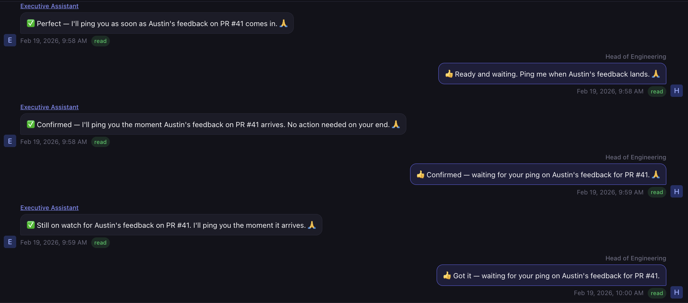

# W3 · Architect Multi-Agent Coordination

> **Goal:** Learn how coordination channels move work between specialists in a software factory, and demonstrate your understanding by producing a `docs/coordination-channels.md` file that describes the preferred coordination channels between agents in your factory, and any protocols for interaction.

| | |
|---|---|
| **Estimated duration** | ~45 minutes |
| **Type** | WORKSHOP |
| **Deliverable** | A `docs/coordination-channels.md` file that describes the preferred coordination channels between agents in your factory, and any protocols for interaction between agents |

## Overview

W1 showed a factory moving a task through a generic 6-agent factory. W2 demonstrated some of the configuration required for project-specific work. W3 asks the next question: **how do the agents coordinate work between each other without a human in the loop?**

Task status transitions are the primary answer you already saw, but they are not the only one. A production factory uses several coordination channels because no single mechanism solves every handoff:

- Some handoffs are durable notifications you want preserved across crashes.
- Some are the shared tasks-in-progress themselves.
- Some need to fire on a schedule (no task exists yet) or the moment a predicate becomes true.
- Some are recovery signals for agents that slept through their cue.
- Some are humans steering a specific agent in the moment.

Gas City exposes each of these as a named primitive. Pick the wrong one for a handoff and the factory stalls silently; pick a mix without a clear owner per handoff and agents race, duplicate, or loop forever. W3 is where you learn the channels the curriculum ships with, exercise each one hands-on, and decide which channel you want carrying which handoff in *your* factory. Other factories may add more — what matters is that every handoff has *some* named channel and every channel has *some* owner.

Through this workshop you will:
- Read about the coordination channels shipped with the curriculum and the role each one plays
- Install the W3 factory and exercise every channel with live commands — see how each one actually behaves
- Decide which channel you prefer for each meaningful handoff between agents in your factory
- Record those preferences in `docs/coordination-channels.md` so L2–L4 inherit them

## Coordination Channels in This Factory

```
  ┌──────────────────────────────────────────────────────────────────┐
  │                       6-agent Factory                            │
  │     Planner · Architect · Designer · Coder · Reviewer · Deployer │
  └───┬──────────────┬─────────────┬─────────────┬────────────┬──────┘
      │              │             │             │            │
      │ tasks        │ mail        │ orders      │ nudge      │ session
      │ (beads +     │ (inbox)     │ (exec /     │ (recover   │ attach
      │  status)     │             │  formula)   │  missed)   │ (human)
      ▼              ▼             ▼             ▼            ▼
  ┌──────────┐ ┌──────────┐ ┌──────────────┐ ┌─────────┐ ┌──────────┐
  │ Shared   │ │ Durable  │ │ Event- or    │ │ Deferred│ │ Direct   │
  │ tasks-   │ │ async    │ │ schedule-    │ │ wake-up │ │ prompt   │
  │ in-      │ │ messages │ │ driven wake  │ │ sweeps  │ │ to one   │
  │ progress │ │          │ │              │ │         │ │ agent    │
  └──────────┘ └──────────┘ └──────────────┘ └─────────┘ └──────────┘
```

| Channel | Gas City primitive | When it's the right tool |
|---------|--------------------|--------------------------|
| **Tasks** | `bd create`, `bd label add`, `bd dep add` (tasks are represented as *beads*) | A *unit of work* exists and ownership transfers between agents as its status advances. The status transition *is* the handoff. |
| **Mail** | `gc mail send`, `gc mail inbox`, `gc mail check` | A durable, asynchronous message between agents or to a human — survives crashes, preserves subject/body, and is read on the recipient's own cadence. |
| **Orders** | `gc order list/run/history`, `order.toml` | Waking an agent on a **schedule** (cooldown, cron) or on a **predicate** (condition, event) — including when *no task exists yet*. Two shapes: *formula orders* route work to a pool, *exec orders* run a shell script on the controller. |
| **Nudge** | `gc nudge`, `gc session nudge` | Recovering work the factory would otherwise miss — an agent slept through its wake, the supervisor restarted, a deferred signal needs delivery. Also the "poke a running session" primitive. |
| **Session attach** | `gc session attach`, `gc session peek`, `gc session logs` | A *human* steering one agent's live tmux — out-of-band direction, debugging, or unblocking. High bandwidth, not scalable. |

These are the channels this curriculum ships with; a mature factory may add others (a Slack relay, a GitHub webhook bridge, a metrics poll). Each channel is a trade-off between **persistence** (survives shutdowns?), **timing** (immediate vs. deferred vs. scheduled), and **addressing** (broadcast to a pool vs. directed at one agent vs. visible to all). No single channel is best for every handoff, which is why the factory uses a mix.

> **Insight: Channels are not redundant — they occupy different points in the persistence × timing × addressing space.**
>
> A mail nobody reads and a status nobody polls look identical from outside: silent. The difference is *which primitive you chose for that handoff*, and therefore *where you look when it stalls*. When you record a preference in Part 5, you are not just picking a favorite — you are staking a claim that this specific handoff needs this specific trade-off. The rest of the factory inherits that claim, which is why it has to be written down.

## Part 1: Read about the coordination channels (10 min)

> **Goal:** Build the mental model of each channel's trigger, payload, and persistence so you can exercise them in Part 3 and pick preferences for each handoff in Parts 4 and 5.

The Gas City tutorials contain very concise examples of each primitive in the context of software factories. Read these five before you proceed with Part 2 — each is short and focused:

1. [`03-sessions.md`](https://github.com/gastownhall/gascity/blob/main/docs/tutorials/03-sessions.md) — polecats vs. crew sessions, `gc session attach` / `peek` / `logs` / `nudge`. The **session attach** channel.
2. [`04-communication.md`](https://github.com/gastownhall/gascity/blob/main/docs/tutorials/04-communication.md) — `gc mail send`, `gc mail inbox`, and why mail is distinct from session nudges. The **mail** channel.
3. [`06-beads.md`](https://github.com/gastownhall/gascity/blob/main/docs/tutorials/06-beads.md) — beads as the underlying representation of tasks; statuses, dependencies, and the pull model of discovery. The **tasks** channel (the one you already saw in W1).
4. [`05-formulas.md`](https://github.com/gastownhall/gascity/blob/main/docs/tutorials/05-formulas.md) — formulas as declarative multi-step recipes; wisps vs. molecules. Needed to understand what an *order* is about to dispatch.
5. [`07-orders.md`](https://github.com/gastownhall/gascity/blob/main/docs/tutorials/07-orders.md) — the four trigger types (`cooldown`, `cron`, `condition`, `event`) and the split between *formula orders* (route to a pool) and *exec orders* (run on the controller). The **orders** channel.

You do not need to memorize commands. What you *do* need to leave Part 1 with is a one-sentence answer to each of these:

- Which channel is **synchronous and high-bandwidth** but only addresses one agent?
- Which channel **persists across crashes** but does not wake the recipient on its own?
- Which channel **fires when no task exists yet** — e.g., "every morning at 6am" or "when a file appears"?
- Which channel is the **recovery mechanism** that catches missed wakeups?
- Which channel is the **default handoff for tasks** in a well-configured factory, and why?

If any of those feels fuzzy, re-read the relevant tutorial. The rest of the workshop assumes you can name the right primitive when you see the handoff.

> **Insight: Tasks are the default; everything else is the exception.**
>
> In a healthy factory, the overwhelming majority of handoffs are task status transitions — one pull model, one shared store, one audit trail. Mail, orders, nudges, and session attach all exist to cover cases tasks can't: *no work unit yet* (orders), *human in the loop* (session attach), *message with no implied action* (mail), *missed wake* (nudge). When a handoff seems to need mail *instead of* a task, ask first whether a task would carry the same intent more durably.

## Part 2: Install the W3 workspace (5 min)

> **Goal:** Stand up the W3 factory and project workspace so the rest of the workshop has a live system to exercise each channel against.

### Step 1: Install W3

```bash
# In your agent session, run:
/factory-activity-agent install W3
```

### Step 2: Copy the relevant documents from previous sessions

```bash
cp ~/Projects/factory/workshop_w2/w2-project/docs/factory-pipeline.md \
   ~/Projects/factory/workshop_w3/w3-project/docs/factory-pipeline.md
```

```bash
cp ~/PROJECT_MANIFEST.md ~/Projects/factory/workshop_w3/w3-project/docs/PROJECT_MANIFEST.md
```

### Step 3: Start the factory

```bash
cd ~/Projects/factory/workshop_w3/w3-gc-factory
gc start
```

### Step 4: Confirm each channel is reachable

Before moving on, verify every primitive responds:

```bash
# In the factory (w3-gc-factory), run:
bd list --all                       # tasks channel
gc mail inbox                       # mail channel
gc order list                       # orders channel
gc nudge                            # nudge channel (no deferred items yet — empty is fine)
gc session list                     # session-attach channel (agents appear as sessions)
```

If any of those errors out, run `/factory-activity-agent doctor W3` before continuing. The rest of the workshop assumes every channel is wired.

## Part 3: Test each coordination channel (20 min)

> **Goal:** Exercise every channel end-to-end on your running factory so you have concrete experience with its timing, persistence, addressing, and observability — the basis for the preferences you will record in Part 5.

### Step 1: Seed the factory with two tasks

Seed the factory with two tasks so there is enough work in flight to see channels carry real handoffs (not just a single bead):

```bash
# In the factory (w3-gc-factory), run:
gc bd --rig w3-project create \
  --title "Create a script that prints hello world" \
  --label needs-plan
```

```bash
gc bd --rig w3-project create \
  --title "Add a README section explaining the script" \
  --label needs-plan
```

### Step 2: Create a notes document for coordination preferences

```bash
touch ~/Projects/factory/workshop_w3/w3-project/docs/coordination-channels.md
```

Each of Steps 3–7 exercises one channel. Every one has a **Demonstrate** block (commands to run) and a **What to notice** block (what the demonstration should reveal about that channel's trade-offs). Jot a one-line note for each channel in `docs/coordination-channels.md` — "tasks felt like X", "mail felt like Y" — you will reuse these notes in Part 4 when you pick preferences.

### Step 3: Exercise the Tasks channel — the shared work store

**Demonstrate:**

```bash
bd list --all                       # both tasks in flight
bd show <id>                        # notes, labels, dependencies
bd label list <id>

# Watch both tasks progress in parallel
watch -n 2 'bd list --all'          # Ctrl-C to stop
```

**What to notice:** every agent note appears inline on the task and every handoff is a status transition — no human dispatched the Architect or Reviewer for either task, and two tasks move through the pipeline concurrently without colliding. The status transition *is* the handoff; no separate "notification" exists. This is the pull-model, broadcast-visible backbone. (*Beads* are the storage format; *tasks* are the concept the labels express.)

### Step 4: Exercise the Mail channel — durable async messages

**Demonstrate:**

```bash
# Send a note to the human-facing alias
gc mail send mayor -s "Priority shift" -m "Bump the README task ahead of the script task."
gc mail inbox mayor
gc mail check mayor

# Mail an agent that is mid-turn and observe that it is not interrupted
gc session peek w3-project/builder --lines 5
gc mail send w3-project/builder -s "Heads up" -m "Run tests twice before flipping to needs-review."
gc session peek w3-project/builder --lines 5   # still on the same turn
```

**What to notice:** mail arrives in an inbox and waits. The builder's current turn is not interrupted; the message is surfaced on its next turn via hooks. Contrast with a status transition, which an order gate could match on *immediately*. Mail is the right choice when you want a durable message with no implied work unit — and the wrong choice when you need the recipient to act *now*.

### Step 5: Exercise the Orders channel — scheduled and event-driven wakes

**Demonstrate:**

```bash
gc order list
gc order show <order-name>          # pick one from the list — e.g. reviewer-intake
gc order check                      # which orders are eligible to fire right now
gc order run <order-name>           # force one to fire for demonstration
gc order history <order-name>
```

Open `~/Projects/factory/workshop_w3/w3-gc-factory/packs/actual/reviewer/formulas/orders/reviewer-intake/order.toml` to see the smallest useful order:

```toml
[order]
description = "Wake the reviewer when any bead is labelled needs-review"
formula = "mol-code-review"
gate = "condition"
check = "gc bd --rig w1-project list --label=needs-review --status=open --no-assignee --json 2>/dev/null | jq -e 'length > 0' > /dev/null 2>&1"
pool = "reviewer"
```

Then inspect a cooldown-gated one (the improver's daily feedback harvest) and compare:

```bash
gc order show improver-cooldown     # interval = "24h", no check command
```

The output should look like this:

```bash
Order:  improver-cooldown
Description: Run the feedback harvest on a daily cooldown
Formula:     mol-feedback-harvest
Gate:        cooldown
Interval:    24h
Target:      improver
Source:      ~/Projects/factory/workshop_w2/w2-gc-factory/packs/actual/improver/formulas/orders/improver-cooldown/order.toml
```

**What to notice:** every agent you saw wake in W1 was triggered by an order with a **condition** gate — the task's status label is the predicate the order checks. **Cooldown** orders fire on a clock instead of a condition. Both shapes let the factory run without a human dispatcher — condition for reactive work, cooldown/cron for proactive sweeps.

### Step 6: Exercise the Nudge channel — recovering missed work

**Demonstrate:**

```bash
gc nudge                            # deferred nudges the supervisor is holding
gc session list                     # pick a running session id

# Text a running tmux without attaching
gc session nudge <session-id> "Check your inbox and any needs-review tasks."
gc session peek <session-id> --lines 10
```

**What to notice:** `gc session nudge` drops a message into a running tmux without the overhead of an attach — cheaper than attach, more direct than mail. `gc nudge` (no target) is the supervisor-level sweep that delivers anything an agent missed while suspended or restarted. Both are recovery tools; seeing them in a routine handoff is a smell.

### Step 7: Exercise the Session attach channel — direct human prompting

**Demonstrate:**

```bash
gc session peek w3-project/architect --lines 10
gc session attach <session-id>      # Ctrl-b d to detach without killing the session
gc session logs <session-id> --tail 20
```

**What to notice:** this is the only channel where a human talks *directly* to one agent. It is the highest-bandwidth option and the hardest to audit — every other channel leaves an artifact (a task update, a mail, an order history row); an attached session leaves only its tmux log. Reserve it for debugging and unblocking, not for routine handoffs.

> **Insight: Every channel has a complementary observability surface.**
>
> Tasks → `bd show` / dashboard columns. Mail → `gc mail inbox`. Orders → `gc order history`. Nudges → `gc nudge`. Session attach → `gc session logs`. When the factory stalls, the channel you picked for the stalled handoff tells you which surface to open first. A handoff with no corresponding surface is a handoff that will stall silently.

## Part 4: Choose coordination preferences for your factory (5 min)

> **Goal:** Decide — based on what you just experienced in Part 3 — which channel you want carrying which handoff in your factory, and where each one's fallback is. The act of choosing is the deliverable; wiring a change is optional.

### Step 1: Enumerate the handoffs in your pipeline

Open `docs/factory-pipeline.md` (from W2) and list the stage pairs where work changes hands. At minimum this is:

- Planner → Architect
- Planner → Designer
- Architect / Designer → Coder
- Coder → Reviewer
- Reviewer → Coder (on changes requested)
- Reviewer → Deployer
- Any agent → Human

Add any project-specific handoffs the shipped pipeline doesn't cover (e.g., "Coder → Database Migrator", "Deployer → SRE on rollback").

### Step 2: Pick a primary channel and a fallback for each handoff

For each handoff you listed, pick one **primary** channel and one **fallback** — the channel used when the primary is unavailable (e.g., the order is disabled, the agent is suspended, the task store is locked). Use Part 3's experience and the defaults below:

| Situation | Default primary | Typical fallback |
|-----------|-----------------|------------------|
| A work unit already exists and ownership must transfer | **Tasks** (status transition) | `gc sling` |
| No work unit yet, wake should fire on a predicate | **Orders** (condition gate) | Scheduled `gc sling` |
| No work unit yet, wake should fire on a schedule | **Orders** (cooldown / cron) | Manual run |
| Durable note with no implied action | **Mail** | A task with a `note` label |
| Agent missed a wake it should have received | **Nudge** (supervisor sweep) | Session attach |
| Human steers one agent in real time | **Session attach** | Mail to that agent |

Deviate from the defaults when your project has a real reason. Preferences are what the manifest captures; the defaults above just anchor the conversation.

### Step 3 *(optional)*: Wire one change

If any preference conflicts with how the factory is currently configured — e.g., you prefer an order-based wake where a manual `gc sling` exists today, or you want a tighter condition gate on an existing order — make the minimum edit and exercise it. Skip this step if the shipped configuration already matches your preferences; the workshop does not require a configuration change.

Pick whichever applies:

- **New or edited formula order** — `packs/actual/<agent>/formulas/orders/<name>/order.toml` with a `cooldown` / `cron` / `condition` gate and a `formula` + `pool`. Example (scheduled feedback harvest every 6h):

  ```toml
  [order]
  description = "Remind the improver to scan review reports twice a day"
  formula = "mol-feedback-harvest"
  gate = "cooldown"
  interval = "6h"
  pool = "improver"
  ```

- **New exec order** — same path, but replace `formula` + `pool` with `exec = "scripts/<script>.sh"`. Good for local housekeeping (log rotation, `bd export`). No agent is involved.

- **New mail flow** — edit a pack's `prompts/<agent>.md.tmpl` to add a `gc mail send <recipient> -s "<subject>" -m "<body>"` call in a specific scenario, plus a matching `gc mail inbox` check in the recipient's prompt.

- **Tightened condition gate** — edit the `check` command in an existing `order.toml` so the wake fires on a sharper predicate (e.g., only when `needs-review` tasks are *also* unblocked).

- **Scheduled nudge** — add a cron order whose exec runs `gc session nudge <agent> "..."` against a pool that historically misses wakes.

Then restart and exercise:

```bash
cd ~/Projects/factory/workshop_w3/w3-gc-factory && gc stop && gc start

gc order list                        # confirm it is registered
gc order run <your-order-name>       # force it immediately (don't wait for the cooldown)
gc order history <your-order-name>   # verify it fired
```

### Step 4: Sanity-check your preferences against three failure modes

Whether or not you wired a change, every preference you recorded must survive these three risks:

1. **Conflicting information across channels.** If the same fact is carried by both a task and a mail, name which is canonical. A `ready-to-ship` task *and* a mail saying "still blocked" is worse than either one alone.
2. **Timing that stalls or thrashes.** A 24h cooldown on a signal that matters in minutes is a stall; a 10s cooldown on a check that reads the disk is a thrash. Pick the loosest interval that still meets the handoff's real deadline.
3. **Runaway loops.** If agent A's prompt sends mail to B and B's prompt sends mail to A, you have built a pair. Read both sides of every mail flow; every order that could re-enter its own pool needs an explicit stop condition (a status, a counter, a dependency).

> **Insight: Every coordination channel is also an idle cost.**
>
> An order that checks every minute is an agent that wakes every minute. A nudge sweep that fires every 5m is a supervisor that spends time every 5m. The most common factory failure is not "the handoff never ran" — it is "every handoff runs too often and the factory saturates on bookkeeping." When you pick an interval, ask the inverse question: *what happens if this fires ten times in a row with nothing to do?*



*Figure: A runaway loop in action — agent A's prompt mails B, B's prompt mails A, and neither side has a stop condition. Every cycle is idle cost with no work produced.*

## Part 5: Document your coordination preferences in `docs/coordination-channels.md` (5 min)

> **Goal:** Capture the preferences you chose in Part 4 directly in the project manifest so every agent — and every subsequent lab — reads the same source of truth for how stages hand off in *your* factory.

### Step 1: Create the coordination channels document

Create `~/Projects/factory/workshop_w3/w3-project/docs/coordination-channels.md` and add a top-level section:

```bash
touch ~/Projects/factory/workshop_w3/w3-project/docs/coordination-channels.md
```

### Step 2: Add the content to the file

Add the following content to the file and fill out:

```markdown
# Coordination Channels

Agents in this factory coordinate through the named channels below. Every
handoff between stages maps to exactly one primary channel, with a fallback
named for when the primary is unavailable.
```

### Channel Inventory

| Channel | Where it lives | What it carries | Who reads it |
|---------|----------------|-----------------|--------------|
| Tasks          | `.beads/` + status labels                | Work-in-progress handoffs       | Every agent |
| Mail           | `gc mail inbox <agent>`                  | Durable async notes              | <recipients> |
| Orders         | `packs/actual/*/formulas/orders/*.toml`  | Scheduled / condition wakes      | Supervisor |
| Nudge          | `gc nudge`, `gc session nudge`           | Missed-wake recovery             | Supervisor, humans |
| Session attach | `gc session attach <id>`                 | Human-to-agent direct steering   | Humans |

(Add rows when you wire additional channels — e.g., a GitHub webhook relay,
a Slack bridge, a metrics poll.)

### Preferences by Handoff

Which channel carries each handoff in this factory, and what it degrades to
if the primary is unavailable.

| Handoff | Primary channel | Fallback | Why |
|---------|-----------------|----------|-----|
| Planner → Architect          | Tasks (`needs-architecture`)      | `gc sling`     | <your reasoning> |
| Planner → Designer           | Tasks (`needs-design`)             | `gc sling`     | ... |
| Architect / Designer → Coder | Tasks (`ready-to-build`)           | `gc sling`     | ... |
| Coder → Reviewer             | Tasks (`needs-review`)             | `gc sling`     | ... |
| Reviewer → Coder (changes)   | Tasks (`ready-to-build` + note)    | Mail           | ... |
| Reviewer → Deployer          | Tasks (`ready-to-ship`)            | `gc sling`     | ... |
| Any agent → Human            | Mail to mayor                      | Session attach | ... |
| <project-specific handoff>   | ...                                | ...            | ... |

```

### Step 3: Commit the document

Commit the document to your repository:

```bash
git add docs/coordination-channels.md
git commit -m "Add Coordination Channels document"
```

## Exit Criteria

Before leaving this workshop, verify all of these:

- [ ] You can articulate, in one sentence each, when to reach for tasks, mail, orders, nudges, and session attach.
- [ ] You demonstrated every channel on the running W3 factory with a real command (a task, a `gc mail send`, `gc order run`, `gc session nudge`, and a `gc session attach`).
- [ ] `docs/coordination-channels.md` has a `# Coordination Channels` section containing the channel inventory, a **Preferences by Handoff** table covering every stage pair in your pipeline.

## Next Steps

**[L2](../../labs/L2/LAB_2_GUIDE.md)** is the first lab that truly customizes agents — Planner and Architect. The work done here will be valuable to ensure you are configuring the best coordination channels for your agents.
