# Factory Wiring · Loyalty Points

The W2 deliverable for Fired Up Pizza. This document is the single piece of paper every agent reads before touching the loyalty-points feature. It exists to answer, in one page, *"what does the factory look like for this feature?"*

---

## Architecture Diagram

```mermaid
graph LR
    FR[Feature Request<br/>bd create] --> P[Planner]
    P -->|work-packages/loyalty-points-system.md| A[Architect]
    A -->|docs/adr/0001-loyalty-points-storage.md| D[Designer]
    D -->|design/loyalty-points-spec.md| C[Coder]
    C -->|branch feat/loyalty-points + src/ code| R[Reviewer]
    R -->|review-reports/loyalty-points-review.md| DP[Deployer]
    DP -->|release-gates/loyalty-points-gate.md| DONE[Release Gate PASS]
```

---

## Per-Agent Table

| Agent      | Reads                                                             | Produces                                                                 |
|------------|-------------------------------------------------------------------|--------------------------------------------------------------------------|
| Planner    | bead description, `docs/PROJECT_MANIFEST.md`                       | `work-packages/loyalty-points-system.md` — stories, AC, tests, scope     |
| Architect  | work package, project manifest, prior ADRs, `CLAUDE.md`            | `docs/adr/0001-loyalty-points-storage.md` — `points_ledger` vs column    |
| Designer   | work package + ADR, project manifest                               | `design/loyalty-points-spec.md` — `LoyaltyBalance` + checkout mutation   |
| Coder      | design spec + work package + project manifest                      | `src/components/LoyaltyBalance.tsx`, `src/db/pointsLedger.ts`, tests      |
| Reviewer   | code diff + design spec + review standards                         | `review-reports/loyalty-points-review.md` — findings + severity          |
| Deployer   | review report + release criteria                                   | `release-gates/loyalty-points-gate.md` — binary PASS/FAIL per criterion  |

---

## Integration Points

Files the feature is allowed to modify:

- `src/api/orders.ts` — award points on `POST /api/v1/orders` after order placement
- `src/pages/OrderConfirmation.tsx` — mount `LoyaltyBalance` and show points earned this order
- `src/db/pointsLedger.ts` — **new** file exposing `award(phone, points)` and `balance(phone)`
- `src/components/LoyaltyBalance.tsx` — **new** component (points shown on confirmation + future cart redeem flow)
- `src/db/schema.sql` — add `points_ledger` table
- `docs/PROJECT_MANIFEST.md` — add `points_ledger` to the Domain Model section

Files the feature must NOT modify:

- Anything outside the list above. In particular, the Reviewer should reject any touch to `src/components/MenuCard.tsx`, `src/api/menu.ts`, or `src/pages/MenuPage.tsx` — the feature is order-confirmation scoped, not menu-scoped.

---

## Architectural Question the Architect Must Resolve

Where does the points ledger live?

- **Option A:** new `points_ledger` table with rows for every award/redeem event (append-only)
- **Option B:** denormalized `points` column on `orders` + a `redemptions` column
- **Option C:** materialized view over existing `orders` (no new storage)

Constraints: SQLite-only, must survive app restart, must support balance lookup by phone number without table scan, must accept future redeem operations.

The ADR is where this decision lands. Downstream agents act on the decision — they do not re-open it.

---

## Handoff Contracts

| From → To | Artifact path | File MUST contain |
|-----------|---------------|-------------------|
| bead → Planner | bead description | feature ask + one architectural question |
| Planner → Architect | `work-packages/loyalty-points-system.md` | Stories with numbered ACs, Scope (IN/OUT), Tests, Open Questions |
| Architect → Designer | `docs/adr/0001-loyalty-points-storage.md` | Context, Options with trade-offs, Decision, Consequences |
| Designer → Coder | `design/loyalty-points-spec.md` | Location, Props, State, Layout, Interactions, Edge Cases, Data Flow |
| Coder → Reviewer | feature branch + all files in Integration Points | Tests that reference the work package's Test section |
| Reviewer → Deployer | `review-reports/loyalty-points-review.md` | Verdict (APPROVE/REQUEST CHANGES/BLOCK) + findings list with severity |
| Deployer → Done | `release-gates/loyalty-points-gate.md` | Binary PASS/FAIL for every Release Criterion in the manifest |

---

## Human Gates

Two gates along this pipeline require human approval before the next agent can start:

1. **After Architect, before Designer** — confirm the storage decision before design work begins. The ADR is the blast radius for the feature; downstream work is expensive if the decision is wrong.
2. **After Reviewer, before Deployer** — confirm the review verdict. Even if the Reviewer says APPROVE, a human initials `bd approve <bead>` before the Deployer runs.

All other handoffs are machine-automated via `orchestrator.yaml`.

---

## Success Criteria

Pulled verbatim from `docs/PROJECT_MANIFEST.md` — the Reviewer and Deployer enforce these:

- Points awarded on order placement with correct rate (1 point per $1 of order total, rounded down)
- Balance visible on order confirmation page within 1 second of order placement
- No points awarded for cancelled orders (rollback path tested)
- `npm test` passes with at least 3 new tests (award, balance, cancel rollback)
- `npm run lint` and `npm run type-check` clean
- No inline styles, no `any` types, no new external dependencies
