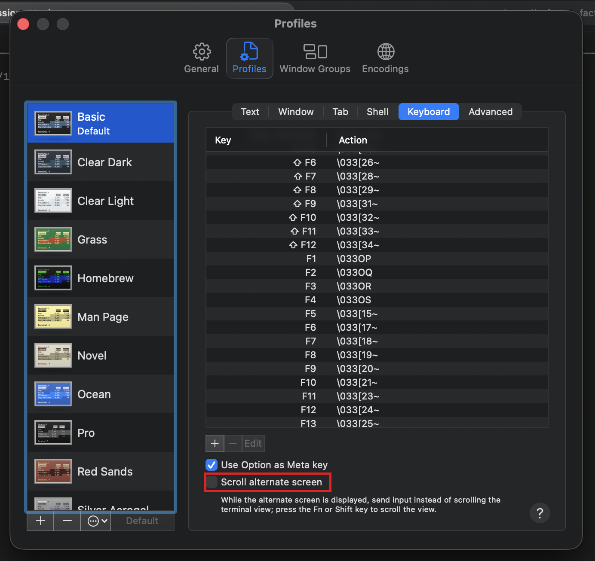

# Troubleshooting tmux

Issues with `tmux` (and related full-screen terminal apps like `vim` and `less`) as you use `gc session peek`, agent shells, and long-running sessions throughout the curriculum.

## Contents

- [Issue: Scroll wheel inside tmux walks prompt history instead of scrolling](#issue-scroll-wheel-inside-tmux-walks-prompt-history-instead-of-scrolling)

---

## Issue: Scroll wheel inside tmux walks prompt history instead of scrolling

**Symptom:** You're inside a `tmux` session (or `vim`, or `less`), scroll the mouse wheel, and the shell cycles through prompt history (or the cursor moves up/down in `vim`) instead of scrolling the terminal view.

**Cause:** `tmux` and other full-screen terminal apps use the terminal's *alternate screen buffer*. By default, macOS Terminal treats scroll-wheel events inside alternate-screen apps as arrow-key input and forwards them to the running program — which is why scrolling inside `tmux` walks your shell history instead of moving the view.

**Fix (macOS Terminal):** Enable **Scroll alternate screen** in Terminal preferences so the scroll wheel moves the view and `Fn`/`Shift` + scroll sends arrow-key input to the alternate-screen app.

1. Open **Terminal** (macOS built-in).
2. Open **Terminal → Settings…** (or press **⌘,**).
3. Select the **Profiles** tab.
4. In the left sidebar, pick your profile (usually the highlighted/default one).
5. In the right pane, select the **Keyboard** sub-tab.
6. Near the bottom, check the **Scroll alternate screen** checkbox.
7. Close Settings. The change applies immediately in new `tmux` sessions; detach and reattach an existing session if it doesn't pick up the new behavior.

**Fix (iTerm2):** iTerm2 has the same setting under **Settings → Profiles → Terminal → "Save lines to scrollback when an app status line is present"** and **"Scroll wheel sends arrow keys when in alternate screen mode"** — toggle the latter *off* for the same effect.

**Fix (other terminals):** Look for a setting named similarly to "alternate screen scroll" or "scrollback in alternate buffer." If the terminal doesn't expose one, use `tmux`'s own scroll mode instead: press `Ctrl-b [` to enter copy mode, scroll or use arrow keys, and `q` to exit.
